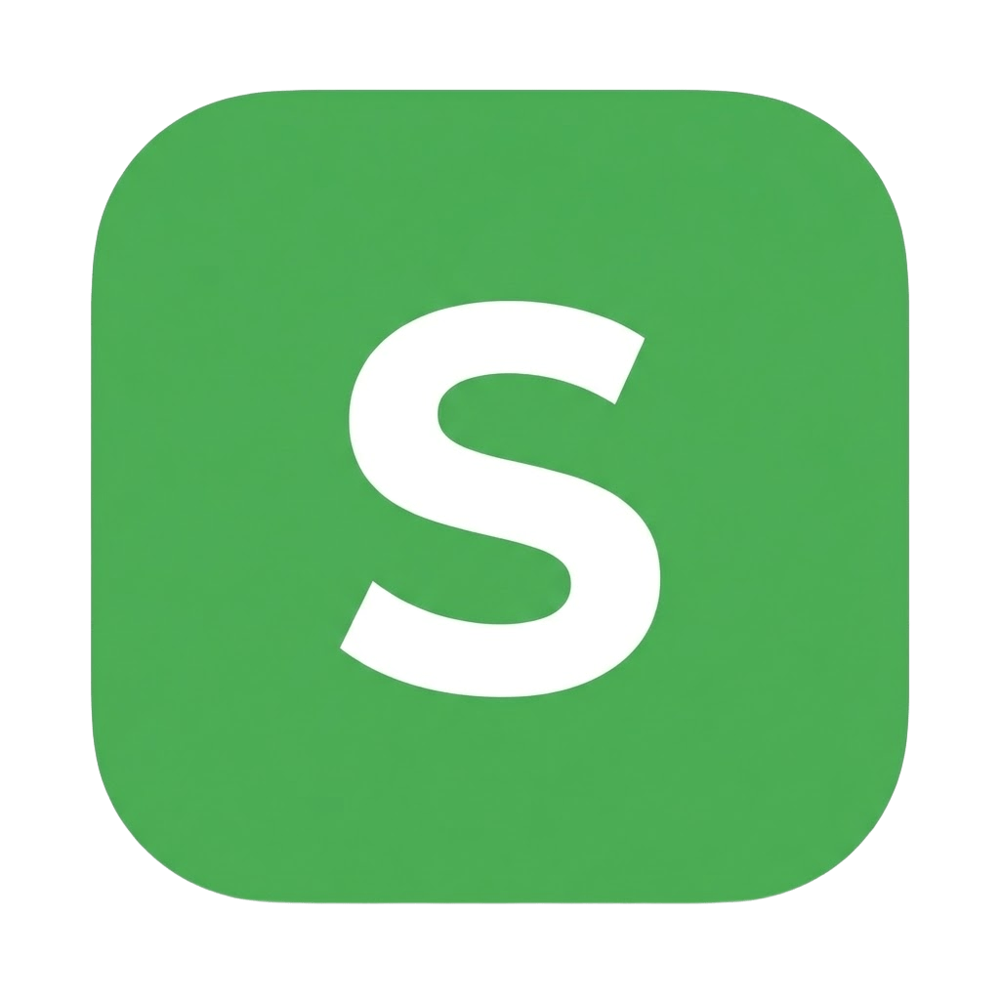

<div align="center">
  
  <h1>slovo</h1>
  
  <p>
    
    
    
  </p>

  <h3>
    <a href="https://slovo-cyan.vercel.app/">👀 Глянути на це чудо (Live Demo)</a>
  </h3>
</div>

<br>

<div align="center" style="max-width: 700px; margin: 0 auto;"> 
  <blockquote> 
    <strong> 
      Цей стек не мій вибір, це вимога методички. <br>
      Тут немає React, бо мені заборонили. Тут немає бекенду, бо я ще не дійшов до цього пункту. <br>
      Все, що тут є це HTML, CSS і моє бажання не вилетіти з коледжу
    </strong> 
  </blockquote> 
</div>

<br>

## 🎓 Що це таке?

**Slovo** — це курсова робота, яка в теорії має бути крутою грою в слова (аналог Wordle, але мультиплеєр і колоди слів). 
**По факту на даний момент** — це пафосний лендинг, який обіцяє золоті гори, "прокачку мозку" і "онлайн дуелі", але поки що вміє лише гарно виглядати і перемикати тему.

Створено, щоб закрити предмет і (можливо) колись дописати логіку.

---

## ⛓️ Технологічний Стек (aka "Вимоги кафедри")

Я обрав цей шлях не тому, що він легкий, а тому що в завданні написано "Native JS only".

* **HTML5** — Каркас, на якому все тримається (як і моя нервова система).
* **CSS3** — Стилі, які вимотали мою фантазію.
* **Vanilla JS** — Використовується для життєво необхідної функції: перемикача теми.

---

## 🤡 Реалізований функціонал

* **Головна сторінка:** Вона існує.
* **Анімації:** Кнопки при наведені красіва зьільшуються. правда красіва?
* **Dark Mode:** Єдина річ, яка працює ідеально. Зберігається в `localStorage`, щоб не випалювати очі перевіряючому вночі.
* **Сторінка "Скоро буде":** Заглушка, яка натякає, що гра колись з'явиться (але це не точно).

---

## 📂 Структура (щоб викладач бачив порядок)

```text
.
├── assets/          # Картинки та іконки (SVG спрайти, бо ми модні)
├── css/             # Стилі (розбиті на файли, як нас вчили)
│   ├── components.css
│   ├── landing.css
│   ├── main.css
│   └── soon.css
├── js/              # Скрипти (поки ніфіга)
├── index.html       # Лендинг
├── soon.html        # Заглушка
└── README.md        # Крик душі